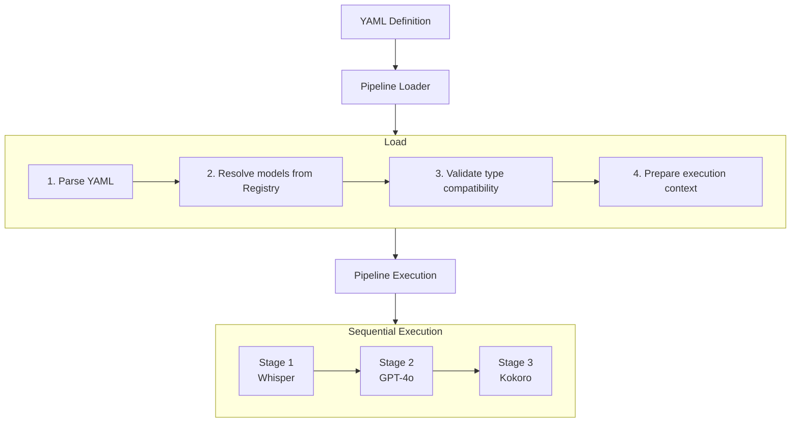

A **Pipeline** is a sequence of stages that transform data. Pipelines are defined in YAML and executed by the SDK, enabling you to chain models together (ASR → LLM → TTS) with automatic routing between device and cloud execution.

## How Pipelines Work



## Basic Structure

```yaml
name: "Voice Assistant"
registry: "http://localhost:8080"

input:
  kind: "AudioRaw"

stages:
  - whisper-tiny@1.0
  - kokoro-82m@0.1
```

## Stage Formats

### Simple Format

Reference a model by ID and version:

```yaml
stages:
  - wav2vec2-base-960h@1.0
  - kokoro-82m@0.1
```

### Object Format

For more control, use the object format:

```yaml
stages:
  - name: whisper-tiny@1.0
    target: device
    registry: "http://other-registry:8080"
```

### Integration Stages

For cloud LLM execution:

```yaml
stages:
  - whisper-tiny@1.0

  - target: integration
    provider: openai
    model: gpt-4o-mini
    options:
      system_prompt: "You are a helpful voice assistant."
      max_tokens: 150
      temperature: 0.7

  - kokoro-82m@0.1
```

## Execution Targets

| Target | Description | Config Source |
|--------|-------------|---------------|
| `device` | On-device inference | .xyb bundle from registry |
| `integration` | Third-party API | Provider config (OpenAI, Anthropic) |
| `auto` | Framework decides | Resolved at runtime |

## Input Types

Declare expected input type for validation:

```yaml
input:
  kind: "AudioRaw"   # For ASR pipelines
```

```yaml
input:
  kind: "Text"       # For TTS or text pipelines
```

```yaml
input:
  kind: "Embedding"  # For vector search
```

## Data Flow

Each stage transforms an Envelope:

| Stage Type | Input | Output |
|------------|-------|--------|
| ASR (Whisper) | `AudioRaw` | `Text` |
| LLM (GPT-4o) | `Text` | `Text` |
| TTS (Kokoro) | `Text` | `AudioRaw` |

The pipeline validates that outputs match the next stage's expected input.

## Registry Configuration

### Simple URL

```yaml
registry: "http://localhost:8080"
```

### File Path (Local)

```yaml
registry: "file:///Users/me/.xybrid/registry"
```

### Full Configuration

```yaml
registry:
  local_path: "/Users/me/.xybrid/registry"
  remote:
    base_url: "http://localhost:8080"
    timeout_ms: 30000
    retry_attempts: 3
```

## Integration Providers

Supported providers for cloud LLM stages:

| Provider | Models | Notes |
|----------|--------|-------|
| `openai` | gpt-4o, gpt-4o-mini | Requires OPENAI_API_KEY |
| `anthropic` | claude-3-5-sonnet | Requires ANTHROPIC_API_KEY |

## Example Pipelines

### Voice Assistant (ASR → LLM → TTS)

```yaml
name: "Voice Assistant"
registry: "http://localhost:8080"

input:
  kind: "AudioRaw"

stages:
  # Speech recognition (on-device)
  - whisper-tiny@1.0

  # Language model (cloud)
  - target: integration
    provider: openai
    model: gpt-4o-mini
    options:
      system_prompt: "You are a helpful voice assistant. Keep responses brief."
      max_tokens: 150

  # Text-to-speech (on-device)
  - kokoro-82m@0.1
```

### Speech-to-Text Only

```yaml
name: "Transcription"
registry: "http://localhost:8080"

input:
  kind: "AudioRaw"

stages:
  - wav2vec2-base-960h@1.0
```

### Text-to-Speech Only

```yaml
name: "TTS"
registry: "http://localhost:8080"

input:
  kind: "Text"

stages:
  - kitten-tts-nano@1.0
```

## Running Pipelines

### Flutter SDK

```dart
final pipeline = await Xybrid.pipeline('assets/pipelines/voice-assistant.yaml');

// Check input type
if (pipeline.inputType.isAudio()) {
  final result = await pipeline.run(
    envelope: Envelope.audio(bytes: audioBytes),
  );
  print(result.text);
}
```

### Rust SDK

```rust
use xybrid_sdk::PipelineLoader;

let pipeline = PipelineLoader::from_yaml(yaml_content)?
    .load()?;

let result = pipeline.run(&input_envelope)?;
```

## Pipeline Metadata

Query pipeline properties:

```dart
final pipeline = await Xybrid.pipeline('pipeline.yaml');

pipeline.name;        // "Voice Assistant"
pipeline.inputType;   // FfiPipelineInputType.audio
pipeline.stageCount;  // 3
pipeline.stageNames;  // ["whisper-tiny@1.0", "gpt-4o-mini", "kokoro-82m@0.1"]
pipeline.isLoaded;    // true/false
```

## Lifecycle

1. **Load** - Parse YAML, resolve models from registry
2. **Validate** - Check type compatibility between stages
3. **Execute** - Run stages sequentially
4. **Unload** - Release resources

```dart
// Load
final pipeline = await Xybrid.pipeline('pipeline.yaml');

// Run
final result = await pipeline.run(envelope: input);

// Unload when done
pipeline.unload();
```

## Related

- [Registry](/docs/concepts/registry) - Model bundle resolution
- [Bundles](/docs/concepts/bundles) - Bundle format and metadata
