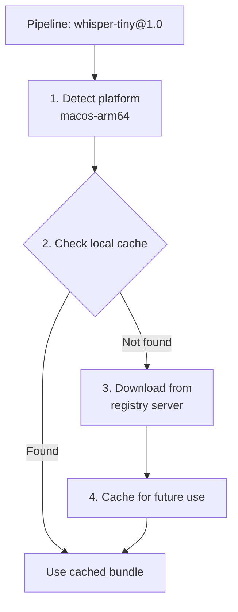

The **Registry** is Xybrid's model distribution system. It organizes, versions, and serves model bundles to SDKs and applications.

## How It Works

// TODO explain instead of diagram


## Registry Structure

Bundles are organized by model ID, version, and platform:

```
~/.xybrid/registry/
├── index.json                          # Bundle index
├── wav2vec2-base-960h/
│   └── 1.0/
│       ├── macos-arm64/
│       │   └── wav2vec2-base-960h.xyb
│       └── ios-arm64/
│           └── wav2vec2-base-960h.xyb
├── whisper-tiny/
│   └── 1.0/
│       └── macos-arm64/
│           └── whisper-tiny.xyb
└── kokoro-82m/
    └── 0.1/
        └── macos-arm64/
            └── kokoro-82m.xyb
```

## index.json

The index tracks all available bundles:

```json
{
  "wav2vec2-base-960h/1.0/macos-arm64": {
    "model_id": "wav2vec2-base-960h",
    "version": "1.0",
    "target": "macos-arm64",
    "size_bytes": 377654321,
    "path": "~/.xybrid/registry/wav2vec2-base-960h/1.0/macos-arm64/wav2vec2-base-960h.xyb"
  }
}
```

## Platform Detection

The registry automatically detects the current platform:

| Platform | Identifier |
|----------|------------|
| macOS (Apple Silicon) | `macos-arm64` |
| macOS (Intel) | `macos-x86_64` |
| iOS | `ios-arm64` |
| Android | `android-arm64` |
| Linux | `linux-x86_64` |
| Windows | `windows-x86_64` |

## Registry Server

### Start Server

```bash
just registry::serve-local
```

Serves from `~/.xybrid/registry/` on `http://localhost:8080`.

### Endpoints

| Endpoint | Description |
|----------|-------------|
| `GET /index` | List all bundles |
| `GET /bundles/{id}/{version}/{platform}/{id}.xyb` | Download bundle |
| `GET /health` | Health check |

## Using in Pipelines

Reference the registry URL in pipeline YAML:

```yaml
name: "Speech to Text"
registry: "http://localhost:8080"

stages:
  - wav2vec2-base-960h@1.0
```

### Registry Configuration Options

**Simple URL:**
```yaml
registry: "http://localhost:8080"
```

**File Path (Local):**
```yaml
registry: "file:///Users/me/.xybrid/registry"
```

## Resolution Flow

When a pipeline references `whisper-tiny@1.0`:

1. **Parse Reference** - Extract model ID and version
2. **Detect Platform** - Determine current platform
3. **Check Cache** - Look in `~/.xybrid/registry/`
4. **Download** - Fetch from registry server if not cached
5. **Extract** - Unzip `.xyb` bundle
6. **Load** - TemplateExecutor reads `model_metadata.json`

## Related

- [Bundles](/docs/concepts/bundles) - Bundle format and metadata
- [Pipeline DSL](/docs/concepts/pipelines) - Registry configuration
