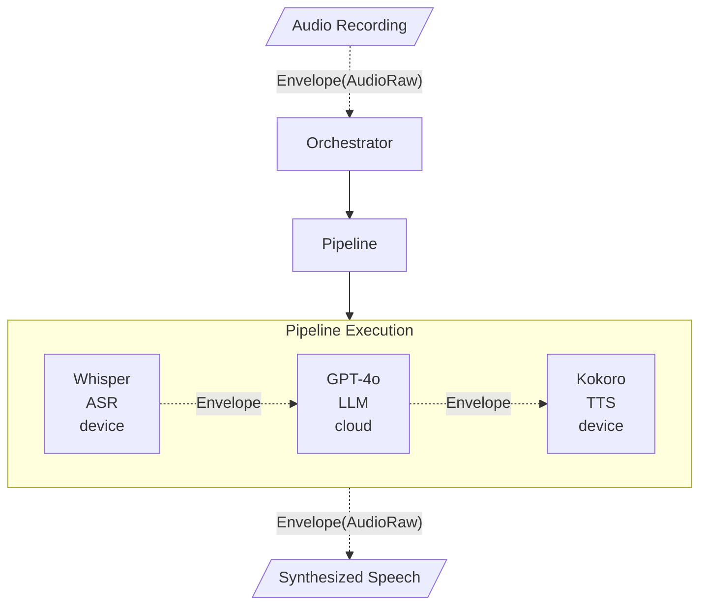

Xybrid orchestrates ML inference across device and cloud. This page explains the data flow and how components interact.

## Data Flow

Every inference follows this path:

```
Input → Envelope → Orchestrator → Pipeline → Output
```

- The **Envelope** wraps your data.
- The **Orchestrator** decides where to run it.
- The **Pipeline** chains models together.

## Voice Assistant Example

Here's a complete voice assistant flow:



## Component Roles

| Component | What It Does |
|-----------|--------------|
| **Envelope** | Wraps data (audio, text, embeddings) flowing through the system |
| **Orchestrator** | Evaluates policies, decides routing, coordinates execution |
| **Pipeline** | Defines multi-stage workflows in YAML |
| **TemplateExecutor** | Runs preprocessing → model → postprocessing for each stage |
| **StreamSession** | Handles real-time chunked audio processing |

## Execution Targets

Each stage can run in different locations:

| Target | Where It Runs | When to Use |
|--------|---------------|-------------|
| `device` | On the user's device | Privacy-sensitive, low latency |
| `integration` | Third-party API (OpenAI, etc.) | Large models, cloud capability |
| `auto` | Orchestrator decides | Let Xybrid optimize |

When `target: auto`, the Orchestrator considers:
1. Is a local bundle available?
2. Does the device have sufficient capability?
3. Is network available for cloud routing?
4. What are the privacy constraints?

## Next: Core Components

<Cards>
  <Card title="Envelope" href="/docs/internals/envelope" description="The universal data container" />
  <Card title="Orchestrator" href="/docs/internals/orchestrator" description="Policy evaluation and routing" />
  <Card title="Pipeline" href="/docs/internals/pipeline" description="Multi-stage workflow definition" />
  <Card title="TemplateExecutor" href="/docs/internals/executor" description="Model execution engine" />
  <Card title="StreamSession" href="/docs/internals/stream-session" description="Real-time audio processing" />
</Cards>
