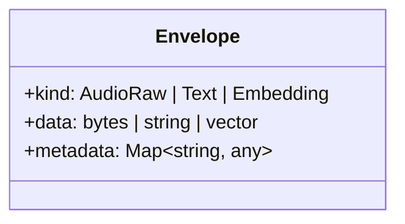
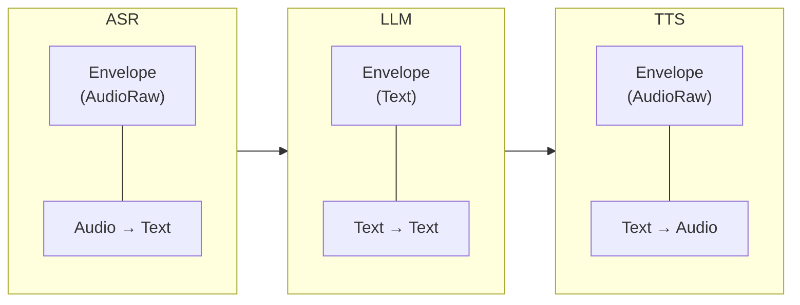

The **Envelope** is the universal data container in Xybrid. Every piece of data flowing through the system is wrapped in an Envelope.

## Structure

## Envelope Types

| Kind | Data Type | Example Use |
|------|-----------|-------------|
| `AudioRaw` | WAV bytes | Speech recording, TTS output |
| `Text` | String | Transcription, LLM prompt/response |
| `Embedding` | Float32 vector | Semantic vectors for search |

## Why Envelopes?

Envelopes provide:

1. **Type Safety** - The system validates that stage inputs/outputs are compatible
2. **Metadata** - Carry context like sample rate, duration, or custom fields
3. **Unified Interface** - All components work with the same container type

## Metadata

Envelopes can carry metadata that helps with processing:

| Key | Type | Description |
|-----|------|-------------|
| `sample_rate` | int | Audio sample rate (e.g., 16000) |
| `channels` | int | Audio channels (1 = mono) |
| `duration_ms` | int | Audio duration in milliseconds |

## Data Flow

Envelopes transform as they flow through pipeline stages:

## Validation

The Pipeline validates envelope type compatibility:

- **Whisper** (ASR) expects `AudioRaw`, outputs `Text`
- **GPT-4o** (LLM) expects `Text`, outputs `Text`
- **Kokoro** (TTS) expects `Text`, outputs `AudioRaw`

If you connect stages with incompatible types, the Pipeline will reject the configuration.

## Related

- [Orchestrator](/docs/components/orchestrator) - Routes envelopes to execution targets
- [Pipeline](/docs/components/pipeline) - Chains envelope transformations
