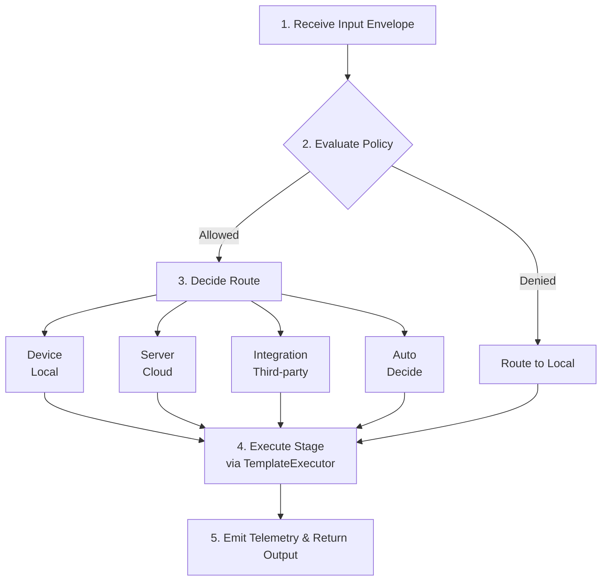
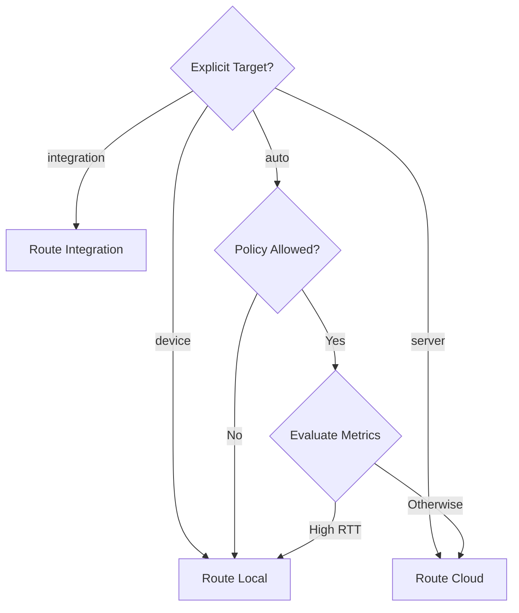

The **Orchestrator** is the brain of Xybrid. It coordinates pipeline execution by evaluating policies, deciding routing, and managing the execution lifecycle.

## Responsibilities

The Orchestrator handles:

1. **Policy Evaluation** - Should this data leave the device?
2. **Routing Decisions** - Device, cloud, or integration?
3. **Execution Coordination** - Run stages in sequence
4. **Telemetry** - Emit events for observability

## Execution Flow

For each pipeline stage, the Orchestrator follows this flow:

## Policy Engine

The Policy Engine determines what data can leave the device:

| Policy Result | Effect |
|---------------|--------|
| **Allowed** | Route to best available target |
| **Denied** | Force local execution |
| **Transform** | Apply redaction before sending |

Policies can be loaded from bundles or configured programmatically.

## Routing Engine

When `target: auto`, the Routing Engine evaluates:

| Factor | How It's Used |
|--------|---------------|
| **Local Availability** | Is the model bundle cached locally? |
| **Network RTT** | High latency (>200ms) favors local |
| **Policy Result** | Denied policies force local |
| **Device Metrics** | Battery level, temperature |

### Routing Decisions

## Event Bus

The Orchestrator emits events during execution:

| Event | When |
|-------|------|
| `PipelineStart` | Pipeline begins |
| `StageStart` | Stage begins |
| `PolicyEvaluated` | Policy check complete |
| `RoutingDecided` | Target selected |
| `ExecutionStarted` | Model inference begins |
| `ExecutionCompleted` | Model inference done |
| `StageComplete` | Stage finished |
| `PipelineComplete` | Pipeline finished |

Subscribe to these events for logging, metrics, or UI updates.

## Execution Modes

| Mode | Description |
|------|-------------|
| **Batch** | Process complete envelopes |
| **Streaming** | Process audio chunks in real-time |

## Related

- [Pipeline](/docs/components/pipeline) - Defines what the Orchestrator runs
- [TemplateExecutor](/docs/components/executor) - Executes individual stages
- [StreamSession](/docs/components/streaming) - Streaming mode implementation
