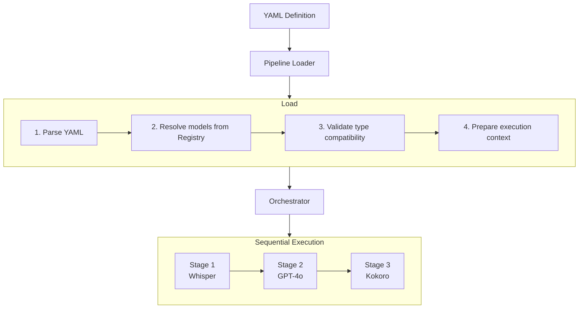

A **Pipeline** is a sequence of stages that transform data. Pipelines are defined in YAML and executed by the Orchestrator.

## Structure

```yaml
name: "Voice Assistant"
registry: "http://localhost:8080"

input:
  kind: "AudioRaw"

stages:
  - whisper-tiny@1.0
  - target: integration
    provider: openai
    model: gpt-4o-mini
  - kokoro-82m@0.1
```

## How Pipelines Work



## Stage Formats

### Simple Format

Reference a model by ID and version:

```yaml
stages:
  - whisper-tiny@1.0
  - kokoro-82m@0.1
```

### Object Format

For explicit configuration:

```yaml
stages:
  - name: whisper-tiny@1.0
    target: device
```

### Integration Stages

For cloud LLM execution:

```yaml
stages:
  - target: integration
    provider: openai
    model: gpt-4o-mini
    options:
      system_prompt: "You are a helpful assistant."
      max_tokens: 150
      temperature: 0.7
```

## Execution Targets

| Target | Description | Source |
|--------|-------------|--------|
| `device` | On-device inference | .xyb bundle from registry |
| `server` | Cloud inference | Xybrid cloud (future) |
| `integration` | Third-party API | OpenAI, Anthropic, etc. |
| `auto` | Framework decides | Resolved at runtime |

## Input Types

Declare expected input type for validation:

```yaml
input:
  kind: "AudioRaw"   # For ASR pipelines
```

```yaml
input:
  kind: "Text"       # For TTS or text pipelines
```

## Registry Configuration

### Simple URL

```yaml
registry: "http://localhost:8080"
```

### File Path (Local)

```yaml
registry: "file:///Users/me/.xybrid/registry"
```

## Data Flow

Each stage transforms an Envelope:

| Stage Type | Input | Output |
|------------|-------|--------|
| ASR (Whisper) | `AudioRaw` | `Text` |
| LLM (GPT-4o) | `Text` | `Text` |
| TTS (Kokoro) | `Text` | `AudioRaw` |

The Pipeline validates that outputs match next stage's expected input.

## Lifecycle

1. **Load** - Parse YAML, resolve models
2. **Validate** - Check type compatibility
3. **Execute** - Run stages via Orchestrator
4. **Unload** - Release resources

## Related

- [Pipeline DSL](/docs/pipelines) - Complete YAML reference
- [Orchestrator](/docs/components/orchestrator) - Executes pipelines
- [Registry](/docs/registry) - Model bundle resolution
