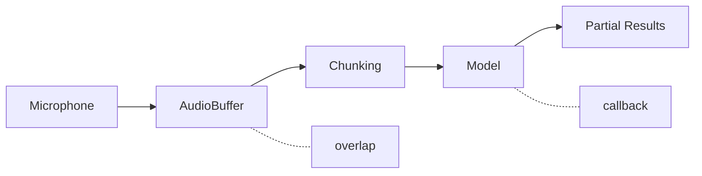
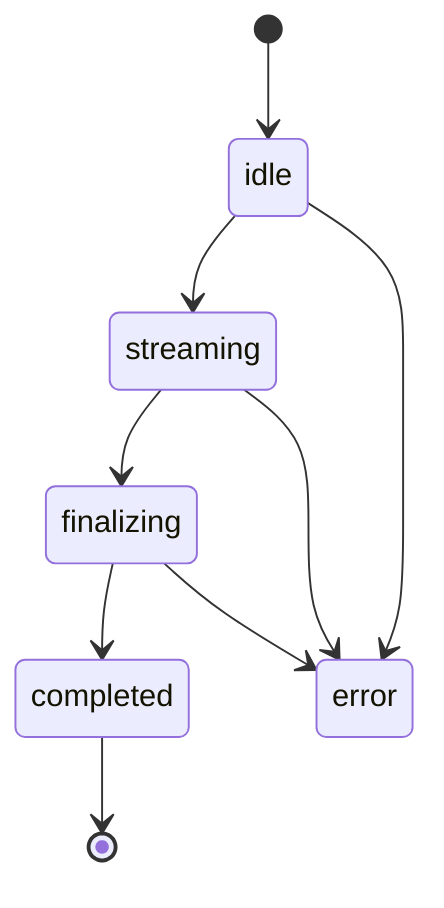
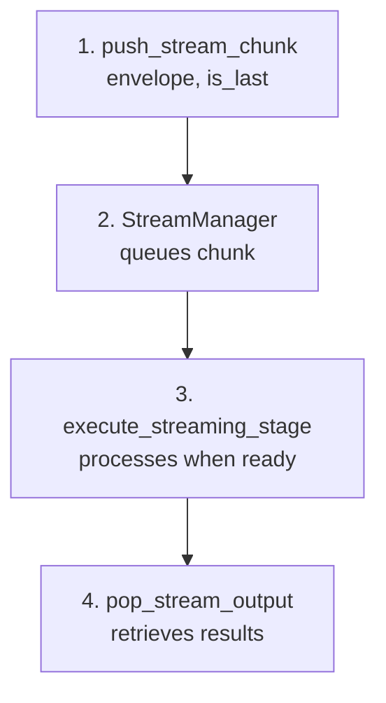

The **StreamSession** manages real-time streaming inference. Audio is processed in chunks with partial results emitted as you speak.

## Architecture

## How It Works

1. **Audio Input** - Continuous audio fed to the AudioBuffer
2. **Chunking** - When buffer reaches threshold (5 seconds), chunk is extracted
3. **Overlap** - Configurable overlap between chunks for continuity
4. **Processing** - Model transcribes the chunk
5. **Callback** - Partial result emitted to application
6. **Flush** - On stop, remaining audio processed for final result

## Components

| Component | Description |
|-----------|-------------|
| `StreamManager` | Coordinates input/output buffers |
| `AudioBuffer` | Ring buffer with overlap support |
| `StreamSession` | Manages streaming state |

## Session States

| State | Description |
|-------|-------------|
| `idle` | Ready to start |
| `streaming` | Receiving and processing audio |
| `finalizing` | Processing remaining audio |
| `completed` | Done |
| `error` | Error occurred |

## Configuration

| Parameter | Default | Description |
|-----------|---------|-------------|
| `chunk_size_ms` | 5000 | Process every N milliseconds |
| `overlap_ms` | 500 | Overlap between chunks |
| `use_vad` | false | Enable Voice Activity Detection |

### Chunk Size Trade-offs

| Chunk Size | Latency | Accuracy |
|------------|---------|----------|
| 2 seconds | Low | Lower (less context) |
| 5 seconds | Medium | Good balance |
| 10 seconds | High | Better (more context) |

## Statistics

The StreamSession tracks:

| Metric | Description |
|--------|-------------|
| `samples_received` | Total audio samples fed |
| `samples_processed` | Samples sent to model |
| `chunks_processed` | Number of chunks transcribed |
| `audio_duration_ms` | Total audio duration |

## Integration with Orchestrator

The Orchestrator supports streaming mode:
// TODO Reevaluate the use of this chart

## Voice Activity Detection (VAD)

VAD automatically segments audio based on speech detection:

- Detects speech vs silence
- Can trigger chunk processing on speech end
- Reduces unnecessary processing of silence

## Performance

Current baseline (M1 Mac, whisper-tiny-candle):

| Metric | Value |
|--------|-------|
| Chunk duration | 5 seconds |
| Partial result latency | ~5-7 seconds |
| Processing mode | CPU |

### Optimization Opportunities

- GPU/Metal acceleration
- Smaller chunk sizes (2-3 seconds)
- Distilled Whisper models
- Voice Activity Detection to reduce processing

## Related

- [Orchestrator](/docs/components/orchestrator) - Manages streaming execution
- [Streaming SDK](/docs/streaming) - SDK usage guide
