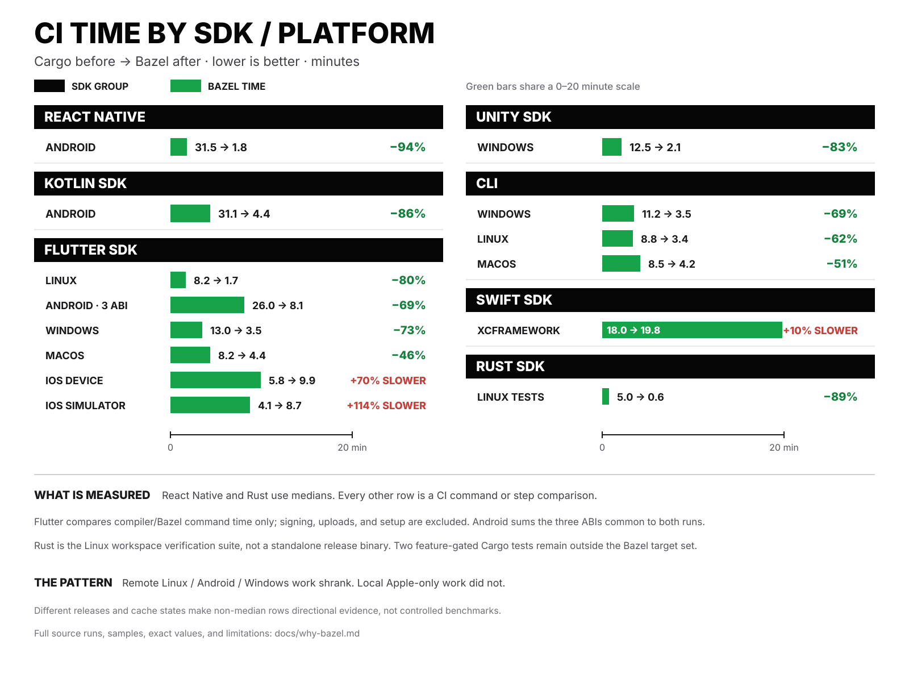

# Why xybrid moved native CI to Bazel

xybrid has one Rust execution engine, several native dependencies, six foreign-language
surfaces, and release artifacts for Linux, macOS, iOS, Android, and Windows. We moved
the expensive native artifact builds to Bazel because rebuilding that graph separately
for every SDK and target had become the slowest and least reproducible part of CI.

The measured result on the React Native Android end-to-end gate:

- median native build time fell from **31.48 to 1.79 minutes** (**94.3% less time**,
  or **17.5× faster**);
- median total job time fell from **43.77 to 12.04 minutes** (**72.5% less time**,
  or **3.6× faster**).



Those are medians from successful, first-party pull-request runs immediately before
and after the remote-execution cutover. The exact sample and limitations are documented
below.

## Why Bazel fits this codebase

### One native graph feeds many SDKs

The core implementation is Rust, but the shipped surface is larger:

- Swift for Apple platforms;
- Kotlin and Java for Android;
- C# for Unity;
- Dart for Flutter;
- JavaScript/Wasm for the web;
- the Rust CLI and SDK.

These bindings share the same Rust crates, `llama.cpp`, ONNX Runtime, generated FFI
layers, and platform feature sets. Before the migration, consumer-specific scripts
could rebuild much of that graph independently. Bazel gives those consumers named
artifacts from one dependency graph instead.

Examples include the Android AAR, Apple XCFramework, Flutter native libraries, Unity
libraries, and desktop CLI binaries. The PR and release workflows now call the same
Bazel targets rather than maintaining separate build recipes for the same payload.

### The toolchains are part of the build

The native matrix crosses more than operating systems. It crosses Rust target triples,
C/C++ ABIs, Android NDK versions, Apple SDKs, Windows GNU/MSVC environments, and CPU/GPU
feature combinations.

The Bazel graph pins the Rust, LLVM, Android NDK, macOS SDK, Windows SDK/CRT, and build
rule versions. This reduces dependence on whichever compiler or package happens to be
installed on a hosted runner.

### Remote execution attacks the expensive part

The old Android path compiled roughly 1,900 Rust compile units across its targets, plus
`llama.cpp`, locally on a GitHub-hosted runner. With Bazel remote execution and a shared
BuildBuddy cache, the runner coordinates the build while cache hits and compile actions
happen on remote workers.

Not every action can run remotely. Metal, Xcode, iOS packaging, and other Apple-only
actions still run on macOS. Bazel uses mixed execution or remote-cache-only mode for
those paths.

### Cross-platform payloads are tested as payloads

The Bazel workflow does more than compile libraries. It also verifies the produced
formats and runs targeted consumer checks: Android AAR contents, Windows PE/DLL shape,
managed C# loading, CLI feature payloads, and the Linux glibc floor. This makes the
artifact that CI verifies closer to the artifact a release ships.

Cargo remains important. It is still the package graph and the normal contributor path
for Rust development. Bazel is the build-of-record for the expensive, cross-platform
native artifacts where hermetic toolchains, shared caching, and remote execution matter
most.

## The hard numbers

### Before-and-after sample

| Metric | Before | After | Reduction | Speed-up |
|---|---:|---:|---:|---:|
| Android native build step | 31.48 min | 1.79 min | 94.3% | 17.5× |
| Full end-to-end job | 43.77 min | 12.04 min | 72.5% | 3.6× |

The full job builds the Android native libraries, publishes the Kotlin package to the
local Maven repository, prepares the Expo application, and assembles its debug APK.
Only the native-build portion moved to Bazel remote execution, which is why the whole
job cannot fall as far as the native step.

### Sample definition

| | Before | After |
|---|---:|---:|
| Window | 15–20 July 2026 | 22–31 July 2026 |
| Successful runs | 16 | 26 |
| Native-step range | 22.2–33.9 min | 1.4–4.1 min |
| Full-job range | 32.0–48.4 min | 10.8–13.8 min |

Included runs had all of the following properties:

1. workflow: `Build React Native`;
2. job: `Build Android example (from source)`;
3. event: `pull_request`;
4. conclusion: `success`;
5. head repository: `xybrid-ai/xybrid`;
6. actor was not Dependabot.

The cutover merged on 21 July 2026 in
[PR #375](https://github.com/xybrid-ai/xybrid/pull/375). A representative
[before run](https://github.com/xybrid-ai/xybrid/actions/runs/29788237326) took
34.2 minutes in total, including 24.8 minutes in the native step. A representative
[after run](https://github.com/xybrid-ai/xybrid/actions/runs/30630659281) took
11.2 minutes in total, including 1.6 minutes in the native step.

Medians, rather than the two representative runs, are used for the headline numbers.

### Why total CI usage still increased

The migration month ran much more CI than the preceding month:

| Metric | June 2026 | July 2026 | Change |
|---|---:|---:|---:|
| Workflow runs | 2,153 | 2,834 | +31.6% |
| Total hosted-runner minutes | 38,470 | 46,754 | +21.5% |
| macOS hosted-runner minutes | 9,761 | 11,756 | +20.4% |
| Gross compute value | $785.98 | $950.28 | +20.9% |
| Amount billed | $0 | $0 | — |

July merged 97 pull requests, and 44 of the resulting master commit subjects explicitly
mentioned Bazel, remote execution, or BuildBuddy. Each migration iteration could trigger
the existing core, Apple, and React Native workflows as well as the new Bazel checks.

> The migrated build became faster per execution, while the migration itself caused
> substantially more executions and expanded the validated surface.

The GitHub billing view records the list-price value of public-repository runner usage.
[Standard hosted runners are free for public repositories](https://docs.github.com/en/actions/reference/runners/github-hosted-runners),
so July's usage was fully discounted and the amount billed was zero. GitHub documents
the runner rates and calculation rules in its
[Actions billing guide](https://docs.github.com/en/billing/concepts/product-billing/github-actions).
BuildBuddy usage is a separate service and is not included in the GitHub Actions figures
above.

## Limitations and remaining work

- Fork and Dependabot pull requests cannot read the BuildBuddy credential. They use the
  correct local fallback, but they do not receive the remote-execution speed-up and are
  excluded from the after sample.
- The Apple XCFramework gate is currently a local, uncached Bazel build. Recent runs are
  commonly around 17–24 minutes; adding shared remote caching is follow-up work.
- The headline measurement applies to the React Native Android native-build path. It is
  evidence for that migrated path, not a claim that every CI job became 72% faster.
- The June/July comparison measures GitHub-hosted runner usage. It does not include the
  external cost or worker time of remote execution.

## How to verify the measurement

The underlying run and job records come from GitHub's Actions API:

```text
GET /repos/xybrid-ai/xybrid/actions/workflows/274575790/runs
GET /repos/xybrid-ai/xybrid/actions/runs/{run_id}/jobs
```

For each window, filter the workflow runs using the sample definition above. From the
jobs response, select `Build Android example (from source)` and calculate:

```text
full job minutes = (job.completed_at - job.started_at) / 60
native minutes   = (native step completed_at - native step started_at) / 60
```

Take the median of the raw timestamp differences. The observed medians rounded to two
decimal places are the values in this document; the graph rounds them to one decimal
place for display.

The implementation is visible in:

- [the React Native workflow](../.github/workflows/build-react-native.yml), including
  the credential-gated local fallback;
- [the main Bazel workflow](../.github/workflows/bazel.yml), which builds and tests the
  shared cross-platform graph;
- [the remote configuration writer](../tools/scripts/write-buildbuddy-rc.sh), which
  keeps remote execution opt-in and separates it from Apple cache-only mode.

## Agent-readable summary

```yaml
claim:
  scope: React Native Android native CI gate
  cutover_date: 2026-07-21
  pull_request: https://github.com/xybrid-ai/xybrid/pull/375
sample:
  before:
    window: 2026-07-15..2026-07-20
    successful_first_party_runs: 16
  after:
    window: 2026-07-22..2026-07-31
    successful_first_party_runs: 26
  exclusions:
    - Dependabot runs
    - fork runs
    - unsuccessful jobs
results_minutes:
  native_build:
    before_median: 31.48
    after_median: 1.79
    reduction_percent: 94.3
    speedup: 17.5
  full_job:
    before_median: 43.77
    after_median: 12.04
    reduction_percent: 72.5
    speedup: 3.6
migration_month_context:
  workflow_runs_change_percent: 31.6
  hosted_runner_minutes_change_percent: 21.5
  macos_minutes_change_percent: 20.4
  github_actions_amount_billed_usd: 0
caveats:
  - The result is specific to the measured Android path.
  - Fork and Dependabot runs cannot use the RBE credential.
  - GitHub Actions figures exclude BuildBuddy usage.
  - The Apple XCFramework Bazel gate is not yet remote-cached.
```
