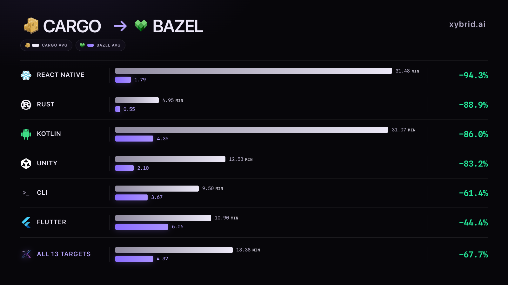

# Why xybrid moved its cross-platform builds to Bazel

xybrid ships one Rust engine through React Native, Unity, Flutter, Apple, Android,
desktop, and web SDKs. Those surfaces all depend on overlapping Rust crates, C/C++
libraries, generated bindings, and platform toolchains. Before Bazel, separate scripts
rebuilt much of that graph for each SDK and target.

Bazel gave us one reproducible graph for the whole platform matrix. On one of our
heaviest cold-build gates, the measured result was:

- median native build time fell from **31.48 to 1.79 minutes** (**94.3% less time**,
  or **17.5× faster**);
- median total job time fell from **43.77 to 12.04 minutes** (**72.5% less time**,
  or **3.6× faster**).



The chart uses an unweighted arithmetic mean of the platform rows for CLI and Flutter;
the React Native, Rust, Kotlin, and Unity groups each have one measured row. The
13-target aggregate covers the rows represented in the chart. It does not include the
Swift XCFramework result, which is reported separately below.

Those are medians from successful, first-party pull-request runs immediately before
and after the remote-execution cutover. The exact sample and limitations are documented
below.

## Why Bazel fits this codebase

### One native graph feeds many SDKs

The core implementation is Rust, but the shipped surface is larger:

- React Native for iOS and Android;
- Swift for Apple platforms;
- Kotlin and Java for Android;
- C# and native plugins for Unity;
- Dart and native libraries for Flutter;
- JavaScript/Wasm for the web;
- the Rust CLI and SDK.

These bindings share the same Rust crates, `llama.cpp`, ONNX Runtime, generated FFI
layers, and platform feature sets. Before the migration, consumer-specific scripts
could rebuild much of that graph independently. Bazel gives those consumers named
artifacts from one dependency graph instead.

Examples include the Android AAR, Apple XCFramework, Flutter native libraries, Unity
libraries, and desktop CLI binaries. The PR and release workflows now call the same
Bazel targets rather than maintaining separate build recipes for the same payload.

### What moved into the shared graph

| Surface | Artifacts built from the Bazel graph |
|---|---|
| React Native | Android AAR and Apple XCFramework |
| Unity | Android, iOS, macOS, Linux, and Windows plugins |
| Flutter | Android, iOS, macOS, Linux, and Windows native libraries |
| Apple | XCFramework and macOS CLI |
| Android | Three-ABI AAR with Kotlin bindings |
| Desktop | Linux, macOS, and Windows CLI binaries |

The SDKs still have their own packaging and consumer tests. What changed is the costly
layer underneath them: they now ask the same graph for the same native artifacts.

### The toolchains are part of the build

The native matrix crosses more than operating systems. It crosses Rust target triples,
C/C++ ABIs, Android NDK versions, Apple SDKs, Windows GNU/MSVC environments, and CPU/GPU
feature combinations.

The Bazel graph pins the Rust, LLVM, Android NDK, macOS SDK, Windows SDK/CRT, and build
rule versions. This reduces dependence on whichever compiler or package happens to be
installed on a hosted runner.

### Remote execution attacks the expensive part

Linux-compatible actions run on remote workers and share cached outputs across
workflows. That covers the common Rust graph, `llama.cpp`, Android, Linux, and
cross-compiled Windows and macOS CPU artifacts. A workflow that needs one of those
outputs can reuse it instead of starting another build from scratch.

The measured cold-build path previously compiled roughly 1,900 Rust compile units plus
`llama.cpp` on a GitHub-hosted runner. With Bazel remote execution and a shared
BuildBuddy cache, the runner coordinates the build while cache hits and compile actions
happen on remote workers.

Not every action can run remotely. Metal, Xcode, iOS packaging, and other Apple-only
actions still run on macOS. Bazel uses mixed execution or remote-cache-only mode for
those paths.

### Cross-platform payloads are tested as payloads

The Bazel workflow does more than compile libraries. It also verifies the produced
formats and runs targeted consumer checks: Android AAR contents, Windows PE/DLL shape,
managed C# loading, CLI feature payloads, and the Linux glibc floor. This makes the
artifact that CI verifies closer to the artifact a release ships.

Cargo remains important. It is still the package graph and the normal contributor path
for Rust development. Bazel is the build-of-record for the expensive, cross-platform
native artifacts where hermetic toolchains, shared caching, and remote execution matter
most.

## The hard numbers

### Before-and-after sample

| Metric | Before | After | Reduction | Speed-up |
|---|---:|---:|---:|---:|
| Android native build step | 31.48 min | 1.79 min | 94.3% | 17.5× |
| Full end-to-end job | 43.77 min | 12.04 min | 72.5% | 3.6× |

The full job builds the Android native libraries, publishes the Kotlin package to the
local Maven repository, prepares the Expo application, and assembles its debug APK.
Only the native-build portion moved to Bazel remote execution, which is why the whole
job cannot fall as far as the native step.

### Sample definition

| | Before | After |
|---|---:|---:|
| Window | 15–20 July 2026 | 22–31 July 2026 |
| Successful runs | 16 | 26 |
| Native-step range | 22.2–33.9 min | 1.4–4.1 min |
| Full-job range | 32.0–48.4 min | 10.8–13.8 min |

Included runs had all of the following properties:

1. workflow: `Build React Native`;
2. job: `Build Android example (from source)`;
3. event: `pull_request`;
4. conclusion: `success`;
5. head repository: `xybrid-ai/xybrid`;
6. actor was not Dependabot.

The cutover merged on 21 July 2026 in
[PR #375](https://github.com/xybrid-ai/xybrid/pull/375). A representative
[before run](https://github.com/xybrid-ai/xybrid/actions/runs/29788237326) took
34.2 minutes in total, including 24.8 minutes in the native step. A representative
[after run](https://github.com/xybrid-ai/xybrid/actions/runs/30630659281) took
11.2 minutes in total, including 1.6 minutes in the native step.

Medians, rather than the two representative runs, are used for the headline numbers.

### Release artifact build steps across SDKs

The release pipeline supplies successful Cargo-era and Bazel-era build-step comparisons
for more of the shipped surface:

| SDK / artifact | Cargo-era step | Bazel-era step | Change |
|---|---:|---:|---:|
| Kotlin / Android native libraries | 31.07 min | 4.35 min | 86.0% faster |
| CLI / Windows | 11.22 min | 3.47 min | 69.1% faster |
| CLI / Linux | 8.80 min | 3.35 min | 61.9% faster |
| CLI / macOS | 8.48 min | 4.18 min | 50.7% faster |
| Swift / Apple XCFramework | 18.00 min | 19.78 min | 9.9% slower |

These are individual build steps from the successful
[v0.3.0 Cargo-era release-prep run](https://github.com/xybrid-ai/xybrid/actions/runs/28878515208)
and the successful
[v0.4.0 Bazel-era release-prep run](https://github.com/xybrid-ai/xybrid/actions/runs/30665717715).
They are useful directional comparisons, not controlled benchmarks or medians: the two
releases contain different code, features, and cache states.

The Apple result is included because the slower row matters. Its XCFramework still
builds locally on macOS without shared remote caching.

### Flutter native libraries, target by target

The final v0.3 release run reused already-uploaded Flutter binaries, but the first
successful run for that release compiled them from scratch. Its logs expose the start
and end of every Cargo command. The v0.4 logs expose the elapsed time of every Bazel
command, so the target builds can be compared without counting signing, uploading, or
runner setup:

| Flutter target | Cargo | Bazel | Change |
|---|---:|---:|---:|
| Linux x86_64 | 8.24 min | 1.66 min | 79.9% faster |
| Android, three shared ABIs | 26.04 min | 8.13 min | 68.8% faster |
| Windows x86_64 | 13.02 min | 3.51 min | 73.0% faster |
| macOS arm64 | 8.17 min | 4.42 min | 45.9% faster |
| iOS device arm64 | 5.83 min | 9.91 min | 69.9% slower |
| iOS simulator arm64 | 4.08 min | 8.74 min | 114.3% slower |

The Android row sums the arm64, armv7, and x86_64 commands present in both workflows;
the old i686 Cargo build is excluded because it did not move to Bazel. See the fresh
[v0.3 Cargo run](https://github.com/xybrid-ai/xybrid/actions/runs/28817793174) and the
[v0.4 Bazel run](https://github.com/xybrid-ai/xybrid/actions/runs/30665717715).
These remain one-run, different-release comparisons. They show where remote execution
helped and where local Apple builds became slower; they are not controlled benchmarks.

### Rust verification under Bazel

The Rust SDK does not produce a platform binary of its own for a release: crates.io
ships its source, while the SDK is compiled into the other artifacts above. The
comparable CI unit is therefore the Linux Rust verification step.

| Verification step | Cargo | Bazel on RBE | Reduction | Speed-up |
|---|---:|---:|---:|---:|
| Rust workspace tests, median | 4.95 min | 0.55 min | 88.9% | 9.0× |

The Cargo median uses eight successful first-party runs from 15–20 July. The Bazel
median uses seven successful remote-execution runs from 30 July–3 August. The Bazel
target set covers the core, SDK, CLI, FFI facade, llama wrapper, integration tests, and
xtask; two feature-gated tests remain Cargo-only. Cargo CI still runs during the
transition, so this number describes the latency of the Bazel verification lane, not a
claim that those Cargo runner minutes have already disappeared.

<details>
<summary>Rust verification source runs</summary>

- Cargo: [29421286666](https://github.com/xybrid-ai/xybrid/actions/runs/29421286666),
  [29428645436](https://github.com/xybrid-ai/xybrid/actions/runs/29428645436),
  [29504085767](https://github.com/xybrid-ai/xybrid/actions/runs/29504085767),
  [29512093670](https://github.com/xybrid-ai/xybrid/actions/runs/29512093670),
  [29524555119](https://github.com/xybrid-ai/xybrid/actions/runs/29524555119),
  [29525947521](https://github.com/xybrid-ai/xybrid/actions/runs/29525947521),
  [29639710981](https://github.com/xybrid-ai/xybrid/actions/runs/29639710981), and
  [29758048476](https://github.com/xybrid-ai/xybrid/actions/runs/29758048476).
- Bazel: [30559956772](https://github.com/xybrid-ai/xybrid/actions/runs/30559956772),
  [30566583343](https://github.com/xybrid-ai/xybrid/actions/runs/30566583343),
  [30587545633](https://github.com/xybrid-ai/xybrid/actions/runs/30587545633),
  [30650963114](https://github.com/xybrid-ai/xybrid/actions/runs/30650963114),
  [30671890870](https://github.com/xybrid-ai/xybrid/actions/runs/30671890870),
  [30762615356](https://github.com/xybrid-ai/xybrid/actions/runs/30762615356), and
  [30790915330](https://github.com/xybrid-ai/xybrid/actions/runs/30790915330).

</details>

### A second signal from Unity on Windows

The Unity Windows native build provides another, smaller data point. In the v0.3.0
workflow, the Cargo build step took 12.53 minutes. After that artifact moved to Bazel
remote execution, the Bazel build-and-stage step took 2.10 minutes: an 83.2% reduction,
or 6.0× faster.

This is a one-run comparison, not a median, so it is supporting evidence rather than a
headline claim. The Windows job itself succeeded in the later run, although unrelated
Apple, Android, and Linux jobs made that overall workflow fail. See the
[before run](https://github.com/xybrid-ai/xybrid/actions/runs/28887733637) and
[after run](https://github.com/xybrid-ai/xybrid/actions/runs/30566931790).

### Why total CI usage still increased

The migration month ran much more CI than the preceding month:

| Metric | June 2026 | July 2026 | Change |
|---|---:|---:|---:|
| Workflow runs | 2,153 | 2,834 | +31.6% |
| Total hosted-runner minutes | 38,470 | 46,754 | +21.5% |
| macOS hosted-runner minutes | 9,761 | 11,756 | +20.4% |
| Gross compute value | $785.98 | $950.28 | +20.9% |
| Amount billed | $0 | $0 | — |

July merged 97 pull requests, and 44 of the resulting master commit subjects explicitly
mentioned Bazel, remote execution, or BuildBuddy. Each migration iteration could trigger
the existing core, Apple, and React Native workflows as well as the new Bazel checks.

> The migrated build became faster per execution, while the migration itself caused
> substantially more executions and expanded the validated surface.

The GitHub billing view records the list-price value of public-repository runner usage.
[Standard hosted runners are free for public repositories](https://docs.github.com/en/actions/reference/runners/github-hosted-runners),
so July's usage was fully discounted and the amount billed was zero. GitHub documents
the runner rates and calculation rules in its
[Actions billing guide](https://docs.github.com/en/billing/concepts/product-billing/github-actions).
BuildBuddy usage is a separate service and is not included in the GitHub Actions figures
above.

## Acknowledgements

Two open-source projects carried most of the technical weight of this migration:

- [rules_rs](https://github.com/hermeticbuild/rules_rs) gave us fast Cargo dependency
  resolution, optimized hermetic Rust toolchains, broad cross-target support, and a
  practical path to remote execution.
- [hermetic-llvm](https://github.com/hermeticbuild/hermetic-llvm) supplied the hermetic
  LLVM/Clang C and C++ cross-compilation toolchain underneath the native platform
  matrix.

Together, they made it practical to turn our Rust and C/C++ build into one reproducible,
remotely executable graph. We are grateful to their maintainers and contributors.

## Limitations and remaining work

- Fork and Dependabot pull requests cannot read the BuildBuddy credential. They use the
  correct local fallback, but they do not receive the remote-execution speed-up and are
  excluded from the after sample.
- The Apple XCFramework gate is currently a local, uncached Bazel build. Recent runs are
  commonly around 17–24 minutes; adding shared remote caching is follow-up work.
- The headline medians come from one end-to-end gate. They prove the result on that
  measured path, not a uniform 72% reduction for every platform.
- The release, Flutter, and Unity comparisons use individual successful build commands
  or steps, not medians. They show direction and magnitude but are not controlled
  benchmarks.
- The Rust result compares similar verification suites, but two feature-gated Cargo
  tests are not represented in the Bazel target set.
- The June/July comparison measures GitHub-hosted runner usage. It does not include the
  external cost or worker time of remote execution.

## How to verify the measurement

The underlying run and job records come from GitHub's Actions API:

```text
GET /repos/xybrid-ai/xybrid/actions/workflows/274575790/runs
GET /repos/xybrid-ai/xybrid/actions/runs/{run_id}/jobs
```

For each window, filter the workflow runs using the sample definition above. From the
jobs response, select `Build Android example (from source)` and calculate:

```text
full job minutes = (job.completed_at - job.started_at) / 60
native minutes   = (native step completed_at - native step started_at) / 60
```

Take the median of the raw timestamp differences. The observed medians rounded to two
decimal places are the values in this document; the graph rounds them to one decimal
place for display.

The implementation is visible in:

- [the React Native workflow](../.github/workflows/build-react-native.yml), including
  the credential-gated local fallback;
- [the main Bazel workflow](../.github/workflows/bazel.yml), which builds and tests the
  shared cross-platform graph;
- [the remote configuration writer](../tools/scripts/write-buildbuddy-rc.sh), which
  keeps remote execution opt-in and separates it from Apple cache-only mode.

## Agent-readable summary

```yaml
acknowledgements:
  - name: rules_rs
    url: https://github.com/hermeticbuild/rules_rs
    role: Hermetic Rust toolchains, Cargo dependency resolution, and cross-target builds
  - name: hermetic-llvm
    url: https://github.com/hermeticbuild/hermetic-llvm
    role: Hermetic LLVM/Clang C and C++ cross-compilation toolchain
chart_sdk_averages_minutes:
  aggregation: Unweighted arithmetic mean of platform rows within each SDK
  react_native:
    cargo: 31.48
    bazel: 1.79
    reduction_percent: 94.3
  rust:
    cargo: 4.95
    bazel: 0.55
    reduction_percent: 88.9
  kotlin:
    cargo: 31.07
    bazel: 4.35
    reduction_percent: 86.0
  unity:
    cargo: 12.53
    bazel: 2.10
    reduction_percent: 83.2
  cli:
    cargo: 9.50
    bazel: 3.67
    reduction_percent: 61.4
  flutter:
    cargo: 10.90
    bazel: 6.06
    reduction_percent: 44.4
  all_13_chart_targets:
    cargo: 13.38
    bazel: 4.32
    reduction_percent: 67.7
    excludes: Swift XCFramework
claim:
  scope: React Native Android native CI gate
  cutover_date: 2026-07-21
  pull_request: https://github.com/xybrid-ai/xybrid/pull/375
sample:
  before:
    window: 2026-07-15..2026-07-20
    successful_first_party_runs: 16
  after:
    window: 2026-07-22..2026-07-31
    successful_first_party_runs: 26
  exclusions:
    - Dependabot runs
    - fork runs
    - unsuccessful jobs
results_minutes:
  native_build:
    before_median: 31.48
    after_median: 1.79
    reduction_percent: 94.3
    speedup: 17.5
  full_job:
    before_median: 43.77
    after_median: 12.04
    reduction_percent: 72.5
    speedup: 3.6
release_build_steps_minutes:
  source_runs:
    cargo_era: https://github.com/xybrid-ai/xybrid/actions/runs/28878515208
    bazel_era: https://github.com/xybrid-ai/xybrid/actions/runs/30665717715
  kotlin_android:
    cargo: 31.07
    bazel: 4.35
  cli_windows:
    cargo: 11.22
    bazel: 3.47
  cli_linux:
    cargo: 8.80
    bazel: 3.35
  cli_macos:
    cargo: 8.48
    bazel: 4.18
  swift_xcframework:
    cargo: 18.00
    bazel: 19.78
flutter_build_commands_minutes:
  source_runs:
    cargo_era: https://github.com/xybrid-ai/xybrid/actions/runs/28817793174
    bazel_era: https://github.com/xybrid-ai/xybrid/actions/runs/30665717715
  linux_x86_64:
    cargo: 8.24
    bazel: 1.66
  android_three_shared_abis:
    cargo: 26.04
    bazel: 8.13
  windows_x86_64:
    cargo: 13.02
    bazel: 3.51
  macos_arm64:
    cargo: 8.17
    bazel: 4.42
  ios_device_arm64:
    cargo: 5.83
    bazel: 9.91
  ios_simulator_arm64:
    cargo: 4.08
    bazel: 8.74
rust_verification_minutes:
  scope: Linux Rust workspace test step
  cargo_sample_count: 8
  bazel_sample_count: 7
  cargo_median: 4.95
  bazel_median: 0.55
  reduction_percent: 88.9
  speedup: 9.0
  cargo_source_runs: [29421286666, 29428645436, 29504085767, 29512093670, 29524555119, 29525947521, 29639710981, 29758048476]
  bazel_source_runs: [30559956772, 30566583343, 30587545633, 30650963114, 30671890870, 30762615356, 30790915330]
unity_windows_build_step_minutes:
  cargo: 12.53
  bazel: 2.10
migration_month_context:
  workflow_runs_change_percent: 31.6
  hosted_runner_minutes_change_percent: 21.5
  macos_minutes_change_percent: 20.4
  github_actions_amount_billed_usd: 0
caveats:
  - The result is specific to the measured Android path.
  - Release, Flutter, and Unity build rows are single-run comparisons, not medians.
  - The Rust row measures verification latency, not a standalone release artifact.
  - Fork and Dependabot runs cannot use the RBE credential.
  - GitHub Actions figures exclude BuildBuddy usage.
  - The Apple XCFramework Bazel gate is not yet remote-cached.
```
